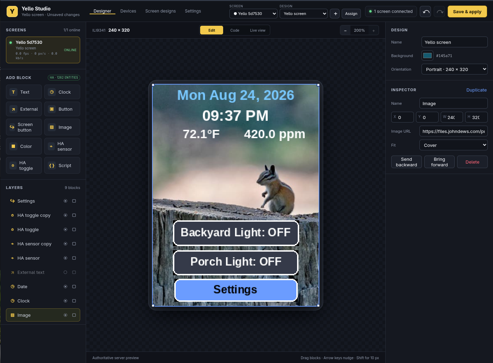
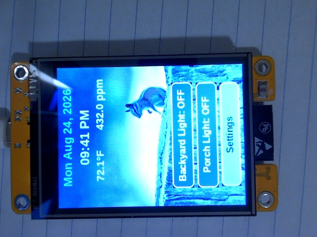

# ESP Yello Device

[](https://github.com/ChooseDews/Yello-Display-Server/actions/workflows/build.yml)
[](https://github.com/ChooseDews/Yello-Display-Server/actions/workflows/docker.yml)
[](https://github.com/ChooseDews/Yello-Display-Server/actions/workflows/windows.yml)
[](https://github.com/ChooseDews/Yello-Display-Server/actions/workflows/linux.yml)
[](https://github.com/ChooseDews/Yello-Display-Server/actions/workflows/macos.yml)

Turn a "Cheap Yellow Display" (ESP32-2432S028R, 2.8" ILI9341 touch screen) into
a network-rendered touch dashboard. A Rust server owns layout, rendering, and
dynamic data; the ESP32 is a dumb terminal that blits RGB565 regions received
over WebSocket and reports touch events back.

Design screens in the browser with **Yello Studio** — drag in text, clocks,
buttons, images, Home Assistant sensors/toggles, and sandboxed scripts, then
hit **Save & apply** to push them to every connected screen.

| Designer | On the device |
|---|---|
|  |  |

## Quick start

1. **Start the server** (designs persist in `studio.json`, credentials in
   `secrets.json` next to the working directory):

   ```sh
   cargo run --release --manifest-path server-rs/Cargo.toml
   ```

   or with Docker (state kept in the `yello-data` volume):

   ```sh
   docker compose up --build -d
   ```

2. **Flash the ESP32** (first-boot setup asks for Wi-Fi and the server
   address on the touchscreen):

   ```sh
   cd firmware
   . /home/john/esp/esp-idf/export.sh
   sg dialout -c "idf.py -p /dev/ttyUSB0 flash"
   ```

3. **Design.** Open <http://127.0.0.1:8080/>, pick your screen, drag blocks,
   and press **Save & apply**. The server listens on `8080` (browser UI) and
   `8765` (device WebSocket) — configure paths/ports via `YELLO_STUDIO_PATH`,
   `YELLO_SECRETS_PATH`, `YELLO_WEB_PORT`, and `YELLO_DEVICE_WS_PORT`.

## Yello Studio

The designer supports text, clocks, external text, buttons, screen buttons, images, color
blocks, sandboxed scripts, Home Assistant sensor values, and Home Assistant entity toggles. Blocks
can be selected, dragged, resized, reordered, hidden, locked,
duplicated, aligned or deleted from a right-click menu, and edited with undo/redo.
Designs can be portrait or landscape, and Live view sends browser touches through
the same action path as the physical display. Connected screens appear in the header;
each can be assigned its own reusable design. **Save & apply** persists the
selected design in `studio.json` atomically and refreshes every connected screen
assigned to it.

A **Screen button** looks and behaves like a normal touch button but opens
another saved design on the device that pressed it. Add a matching screen
button on the destination design to build back, home, and multi-page menu
flows. Navigation changes only the device's current screen; its assigned home
design remains unchanged and is restored when it reconnects.

The designer's **Code** mode exposes the complete normalized layout as JSON.
JSON edits are schema-validated by the server before they are applied to the
visual design, participate in undo/redo, and remain unsaved until **Save & apply**.
Destructive confirmations and design-name entry use Yello Studio dialogs rather
than native browser prompts.

Configure Home Assistant from the dashboard Settings page to enable entity
browsing, state polling, and touch-driven toggles. The token never leaves the
server.

Connected screen cards show rolling rendered FPS, changed pixels per second,
wire bandwidth, 10-second heartbeat age, WiFi RSSI, and device uptime. Online
devices can be restarted from the Devices page. Full-frame transfer uses a tuned 2 ms per-zone cadence
instead of the original 10 ms, and high-volume per-zone firmware logs are
disabled at the normal info level.

## Benchmarks

`bench/run_bench.py` drives fake ESP32 devices (speaking the real binary wire
protocol) against the server and samples server CPU/RSS from `/proc`:

```sh
uv run bench/run_bench.py
```

Raw JSON and server logs land in `bench/results/` (gitignored). The historic
Python-vs-Rust methodology, results, and the concurrency fixes that came out of
them are documented in [docs/server_benchmark.md](docs/server_benchmark.md).

## Test

```sh
cargo test --manifest-path server-rs/Cargo.toml
```

## Build and flash firmware

```sh
cd firmware
. /home/john/esp/esp-idf/export.sh
idf.py build
sg dialout -c "idf.py -p /dev/ttyUSB0 flash"
```

### First-boot device setup

When no usable Wi-Fi configuration exists, the display opens **Device Setup**
before networking starts. Tap a field and use the local keyboard to enter:

- Wi-Fi SSID
- Wi-Fi password
- server hostname or LAN IP
- WebSocket port (normally `8765`)

Tap **Save** to validate and persist the settings in ESP32 NVS. The password is
masked, is never logged, and no longer needs to be compiled into firmware. To
edit an existing configuration, reboot the device and hold the touchscreen for
about one second while **HOLD SCREEN FOR SETUP** is displayed. **Cancel** keeps
the previously saved configuration.

Build-time Kconfig values remain migration/factory defaults. A fresh repository
build intentionally has an empty SSID, so a newly flashed device enters setup.

## Repository layout

| Path | Contents |
|---|---|
| `firmware/` | ESP-IDF v5.5.5 project for the ESP32 display device |
| `server-rs/` | Rust server (tokio/hyper) + Yello Studio web UI + tests |
| `bench/` | Benchmark harness and generated results |
| `docs/` | Long-form write-ups (benchmark analysis, design demos) |
| `capture_frame.py` | Webcam-based screenshot tool for the physical device |

## Screenshot tool

`capture_frame.py` photographs the display through a webcam and processes the
frame into a clean screenshot (deskew, crop, orientation fix):

```sh
uv run capture_frame.py          # writes device_snapshot.jpg
uv run capture_frame.py --raw -o raw.jpg   # unprocessed camera frame
```

Each run archives a timestamped copy under `history/snapshots/`.

## Continuous integration

Continuous integration is split into workflows: server tests (shared via
a reusable workflow), firmware flash artifacts, multi-architecture container
images published to `ghcr.io/<owner>/<repository>`, plus portable builds for
Windows (exe bundle), Linux (AppImage), and macOS (arm64 + x86_64). Pushes run
all of them; on `v*` tags the container is published and the desktop bundles
are attached to the GitHub release.

See [AGENTS.md](AGENTS.md) for confirmed pin mappings, panel quirks, capture
instructions, and the wire-protocol constraints.
